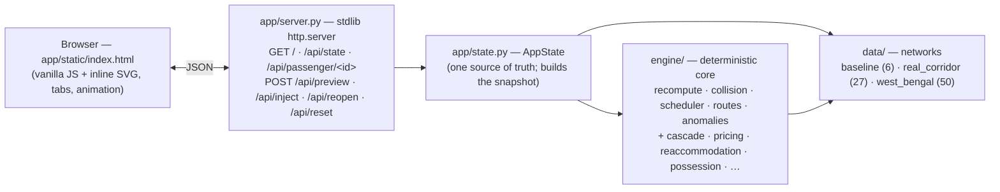

<!-- The block above configures Hugging Face Spaces (Docker SDK). It must stay at
the very top of this file. `app_port: 7860` is the port HF routes to; the
Dockerfile sets PORT=7860 so run_ui.py binds 0.0.0.0:7860. See SPACES_DEPLOY.md
(HF) and DEPLOY.md (Render/Railway). The deployed Space serves the West Bengal
demo at the Space URL. -->

# Train Dispatch & Anomaly Recovery

Safe, automatic, explainable train rescheduling: inject a disruption and watch a deterministic engine recompute a collision-free plan, explain every decision, and keep each passenger's ETA honest.

**Live demo:** https://kabir35-train-dispatch.hf.space  (West Bengal network)

---

## The problem

When a track closes, a train is delayed, or a service is cancelled, a dispatcher must re-plan in minutes: reroute or hold affected trains, keep every track conflict-free, and tell passengers what now happens to their journey. This demo does that automatically on a modelled network — and, crucially, **shows its work**: every minute on screen comes from the engine, with a plain-language reason, and the safety rule (no two trains on one track at once) is enforced by construction.

## What it does

- Runs a live timetable on one of three networks and animates the trains along the track.
- Lets an admin inject anomalies (close/block a track, reduce speed, delay/cancel/restrict a train, add a train).
- Recomputes a **collision-free** schedule that **greedily minimizes delay** (not a solver; not claimed optimal), giving each train a clear action — `unchanged` / `depart_delayed` / `hold` / `reroute` / `cancelled` / `stranded` — with an engine-sourced reason.
- Previews the new plan (dashed "ghosts" on the map) before you apply it.
- Shows the same result two ways that cannot disagree: the admin **Schedule Board / Decision Log** and the **Passenger** view (ETA + fare).

## Key features (all real, in the code)

- **Anomaly controls** (`engine/anomalies.py`): track closed, track blocked, reduced speed, train delayed, train cancelled, per-train track restriction, plus live **add a train** and **selective reopen** of one closed track.
- **Reroute engine** (`engine/recompute.py`): greedy, deterministic placement against a growing occupancy table; a train keeps its plan if conflict-free, else takes the open path with the smallest origin-hold and earliest arrival. Collision-free is a hard constraint of the search, and the whole occupancy table is re-checked after every recompute (`engine/collision.py`).
- **Train priority** (`engine/model.py`): `FREIGHT < PASSENGER < EXPRESS`; under contention a higher-priority train claims the slot and lower-priority trains wait. (All shipped trains use the default, so the recompute golden is unaffected.)
- **Delay cascade — visualized on the map** (`engine/cascade.py`): delaying one train highlights the ripple directly on the network — the **primary delayed train in red**, the **downstream trains it makes late in amber**, each labelled with the inherited minutes (forward re-simulation diff: the schedule re-run with vs without the delay).
- **Passenger re-accommodation** (`engine/reaccommodation.py`): when a train is cancelled, a **Connection-Scan** earliest-arrival search gives each affected origin→destination a real alternative journey (or marks it stranded), computed over the **live** schedule so it reflects other active disruptions.
- **Fare / load visibility** (`engine/pricing.py`): a transparent rule-based fare estimate, framed as demand/load visibility (not surge, not ML) and **frozen during disruption** so an incident never raises a passenger's fare.
- **Additional engine modules** (computed and exposed in the snapshot): naive-baseline comparison (`baseline_compare.py`), eco-driving energy (`eco_driving.py`), regenerative-braking synchronization (`regen_sync.py`), maintenance possession scheduling (`possession.py`) tied to cumulative-load **wear flagging** (`maintenance.py`), and freight **yard classification** under length + hazmat constraints (`freight.py`). These ship in the engine; in the current UI the dedicated **Analysis** tab is hidden (the cascade is surfaced on the map).
- **Explainability with guardrails**: decisions are phrased from engine facts via deterministic templates, and a **drift guard** (`engine/drift_guard.py`) blocks any number or id the engine did not produce.

## Demo walkthrough (11 steps)

Open the live demo (it loads the **West Bengal** network with the headline closure already active), or run locally with `python run_ui.py --wb`.

1. **Press Play.** Trains glide along the West Bengal network; not-yet-departed / arrived trains show as dimmed hollow rakes, moving trains are solid.
2. **Read the headline** at the top: *"vs naive dispatch: total delay reduced 46%"* — the reroute engine vs a naive hold-all (see Measurement).
3. **Schedule Board:** each train shows Departs, Arrivals (origin → destination, with intermediate stops collapsed under "+N stops"), Δ delay, and a wrapped **Why**.
4. **Decision Log:** the same actions in plain language, one line per changed train.
5. **Close a track** (Report a problem → *Close a track*): a **ghost preview** of the new plan appears on the map; click **Apply** to commit. Affected trains reroute around the closure.
6. **Delay a train** (*Delay a train*): the **cascade lights up the map** — red ring on the train you delayed, amber rings + "+N min" on every downstream train that inherits delay.
7. **Block a track / Reduce speed:** other anomaly types — a block routes like a closure; reduced speed makes crossings (and arrivals) later.
8. **Cancel a train,** then open the **Passenger** tab: re-accommodation lists the alternative journeys computed for that train's passengers (or flags those with no remaining route as stranded).
9. **Restrict a train from a track** or **Add a new train:** per-train routing, and a brand-new service slotted in collision-free (held/rerouted as needed) or reported unplaceable.
10. **Reopen a closed track** (surgically, leaving other restrictions in place) or **Reset to baseline** (clears everything).
11. **Passenger tab:** pick a train from the **numeric** dropdown (T1, T2, … T12), see its **journey in travel order** (origin → each stop → destination with arrival minutes), its ETA, and the fare — which displays **🔒 Fare frozen** whenever that train is disrupted.

## Measurement: "total delay reduced 46%"

`engine/baseline_compare.py::compare_dispatch` compares two dispatch policies on the active closure, **both kept collision-free by the same engine** (so only reroute-vs-wait is measured — not a strawman):

- **Naive hold-all:** the trains whose booked path uses the closed track are held until it reopens, then run their original route (everyone else deconflicted normally). A closed track has no scheduled reopen, so the naive policy assumes clearance after **`NAIVE_CLEARANCE_MIN = 180` minutes** (an explicit, surfaced assumption).
- **Reroute engine:** the real managed schedule under the closure.
- **Metric:** total **passenger-delay-minutes** = Σ over trains of `max(0, lateness) × coaches`, where lateness is vs the nominal timetable and coach count is an **illustrative** load proxy (`LOAD_WEIGHTS`), not real bookings.

For the default West Bengal closure (Memari–Barddhaman, `MYM-BWN`), the affected trains are T1 and T3, the reroute total is **11,640** vs the naive **21,512** → a **46% reduction** (and the reroute is never worse across a range of assumed clearance times).

## Fare model (the real formula)

From `engine/pricing.py` — a clear, inspectable rule, **not** ML and **not** revenue surge:

```
fare = (BASE_FLAT + PER_KM · distance)        # base(distance)
       × (1 + OCC_FACTOR · occupancy)         # fuller train -> dearer
       × (1 + TIME_FACTOR · surge)            # imminent departure -> dearer

BASE_FLAT = 20    PER_KM = 0.5    OCC_FACTOR = 0.6    TIME_FACTOR = 0.4
surge     = clamp((SURGE_WINDOW - minutes_to_departure) / SURGE_WINDOW, 0, 1),  SURGE_WINDOW = 120
distance  = sum of segment travel-times on the route (1 minute == 1 km)
occupancy = SYNTHETIC, deterministic per train id, in [0.35, 0.95] (labelled synthetic; production = real bookings)
```

It is presented as **load visibility**, and a disrupted train's fare is **frozen** to its nominal (undisrupted) level — an incident never surges what a passenger pays.

## Tech stack

- **Python standard library only** at runtime — `http.server`, `json`, `dataclasses`, `argparse`, `threading`, `re`, `math`. No third-party frameworks, no API key. `requirements.txt` is intentionally comment-only (it exists so platforms detect a Python project).
- **Frontend:** a single static page (`app/static/index.html`) — vanilla JS + inline SVG, no build step, no framework.
- **Tests:** `pytest` (dev-only). One JS gate (`tests/test_anim_trainplace.py`) drives the shipped browser helpers via **Node** if available (skipped otherwise).
- **Deploy:** a `Dockerfile` for Hugging Face Spaces; the app reads `$PORT` and binds `0.0.0.0` when deployed.

## Architecture



The browser renders entirely from one JSON **snapshot**; the admin board and the passenger view are built from the same `RecomputeResult`, so they cannot disagree.

## Run locally

No install needed — standard library only.

```bash
python run_ui.py            # 6-city baseline demo, opens a browser on http://127.0.0.1:8000/
python run_ui.py --wb       # West Bengal (50 stations) — the headline demo
python run_ui.py --real     # real Indian Railways corridor (27 stations)
```

Useful flags / env:

- `--port N` (default `8000`), `--no-browser`
- `$PORT` (set by Render/Railway/HF) overrides `--port` and binds `0.0.0.0`; otherwise loopback.
- `$DATASET=baseline|real|wb` selects the network if no `--wb`/`--real` flag is given.

## Run the tests

```bash
python -m pytest -q        # 305 passed
```

Tests are value-asserting with hand-verified expected minutes (collision-free guarantees, byte-identical recompute golden, per-feature gates). The recompute golden (`tests/test_recompute_golden.py`) pins engine output byte-for-byte across baseline / real / West Bengal scenarios.

## Networks

| Dataset (`run_ui.py`) | Stations | Segments | Trains |
|---|---|---|---|
| `--wb` West Bengal       | 50 | 58 | 12 |
| `--real` real corridor   | 27 | 27 | 8  |
| (default) 6-city baseline | 6  | 8  | 5  |

## Scope & assumptions (honest by design)

This is a demo, not a signalling-grade system. Each simplification is intentional and documented in full in [`SYSTEM_BOUNDARIES.md`](SYSTEM_BOUNDARIES.md):

1. **Segment exclusivity, not real signalling** — one train per whole section at a time (conservative). Production needs fixed-block / moving-block signalling with interlocking and braking curves.
2. **Single-track assumption** — every link is one shared track; opposing trains are sequenced. Production needs double/multiple track, running lines, loops, platform allocation.
3. **No crew or rake scheduling** — trains are abstract movers; no duty hours, rake links, or turn-arounds.
4. **Deterministic, not stochastic** — fixed travel times; identical inputs give identical plans. Production needs delay distributions and robust/simulation-based recovery.
5. **Regional scale (≈50 stations), not national** — full path enumeration is fine here; national scale needs indexed/heuristic routing.
6. **Passenger re-accommodation is basic** — alternative journeys are computed, but there's no seat/berth inventory, rebooking/ticketing, fare adjustment, or onward-connection protection.

Language is kept honest throughout: the engine **greedily minimizes delay** (not "optimal"), maintenance is **cumulative-load wear flagging** (not "predictive"/AI), pricing is **rule-based load visibility** (not surge/ML), synthetic data is labelled synthetic, and a code review **found no defects in the scheduler** (not "zero bugs").

## Repo layout

```
run_ui.py            entry point (flags + $PORT/$DATASET)
app/                 server.py (stdlib HTTP), state.py (AppState), static/index.html, display.py
engine/              deterministic core + analysis modules (see Key features)
data/                baseline.py, real_corridor.py, west_bengal.py
tests/               305 tests (pytest; one Node-driven JS gate)
Dockerfile           Hugging Face Spaces (Docker SDK)
SYSTEM_BOUNDARIES.md DEPLOY.md SPACES_DEPLOY.md SPEC.md PROGRESS.md
```
